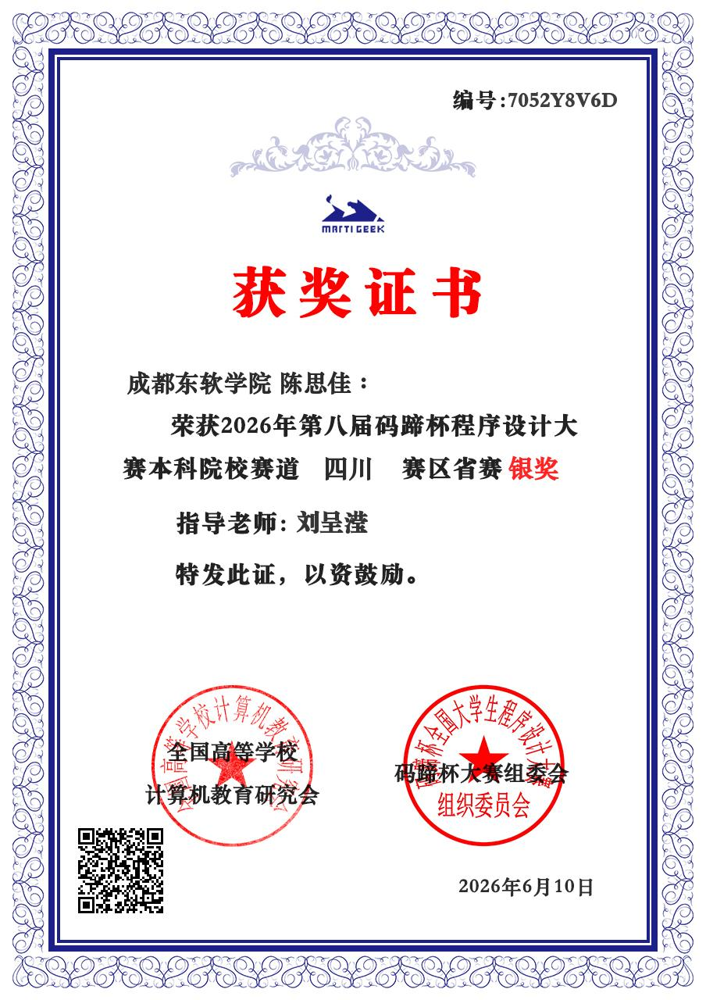
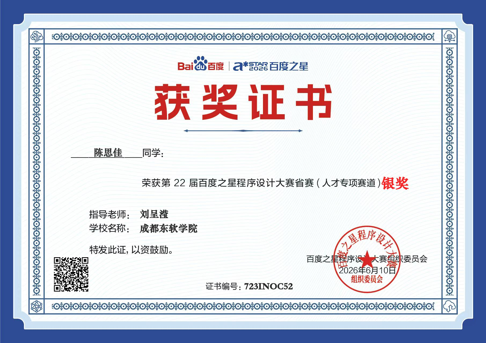
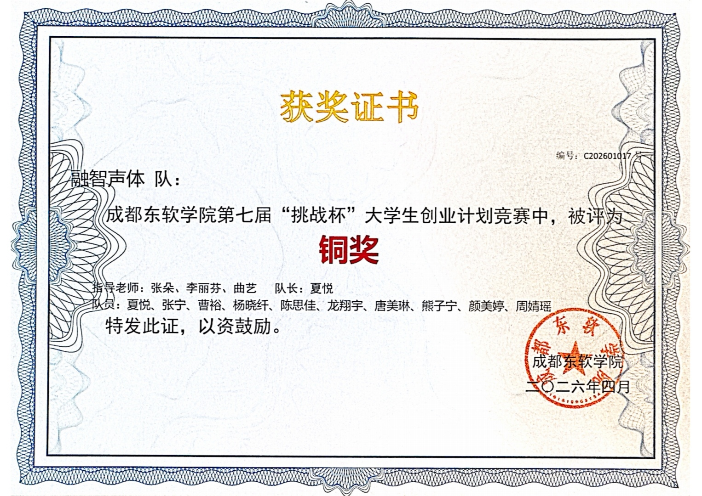
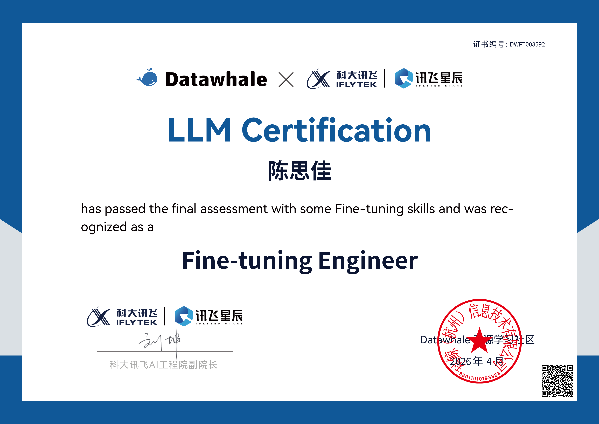
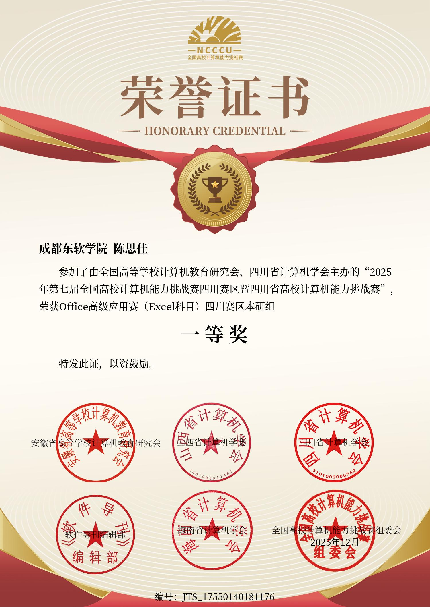
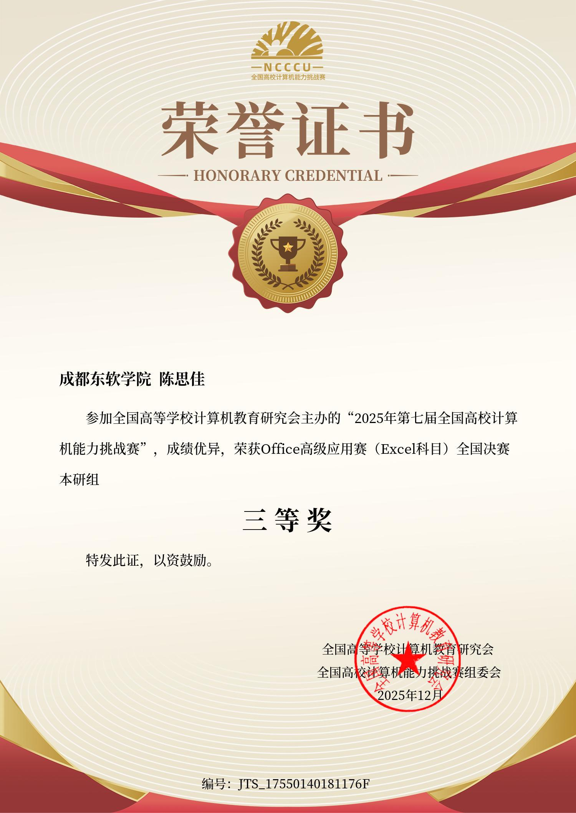

# 陈思佳

**成都东软学院 · 人工智能专业 · 2025 级**

> 人工智能专业在读本科生，热爱算法与程序设计。在编程竞赛、数据处理与大模型微调方向持续积累，习惯用项目与比赛检验所学。

---

## 亮点速览

| 项目 | 数量 |
| --- | --- |
| 竞赛获奖 | 5 项 |
| 国家级奖项 | 1 项 |
| 省级奖项 | 3 项 |
| 专业认证 | 1 项 |

---

## 荣誉奖项

### 2026 年

- **省级 · 银奖** — 第八届码蹄杯程序设计大赛，本科院校赛道四川赛区省赛

- **省级 · 银奖** — 第 22 届百度之星程序设计大赛省赛（人才专项赛道）

- **校级 · 铜奖** — 成都东软学院第七届"挑战杯"大学生创业计划竞赛，团队铜奖（融智声体队）

- **专业认证** — Datawhale × 科大讯飞星辰 LLM 微调工程师认证（Fine-tuning Engineer）

### 2025 年

- **省级 · 一等奖** — 第七届全国高校计算机能力挑战赛 Office 高级应用赛（Excel 科目）四川赛区本研组

- **国家级 · 三等奖** — 第七届全国高校计算机能力挑战赛 Office 高级应用赛（Excel 科目）全国决赛本研组

---

## 项目经历
- **PetHospitalMCP**：宠物医院MCP服务，提供宠物信息管理工具接口，实现增删查改业务工具调用
- **AnythingLLMMCP**：AnythingLLM MCP服务，实现大模型外部工具调用能力
- **AnythingLLMServer**：配套Web服务页面，提供前端交互界面

------

## 能力方向

- **算法与程序设计** — 连续两届参与省级程序设计竞赛（码蹄杯、百度之星），熟悉算法题解与竞赛节奏
- **数据处理与办公自动化** — 全国高校计算机能力挑战赛四川赛区一等奖、全国决赛三等奖，Excel 数据处理与建模能力扎实
- **大模型微调** — 持有 LLM 微调工程师认证，具备微调数据集构造、训练与评估的实践能力
- **团队协作与项目落地** — "挑战杯"创业计划竞赛团队成员，参与从方案到路演的完整流程

---

*最后更新：2026 年*

